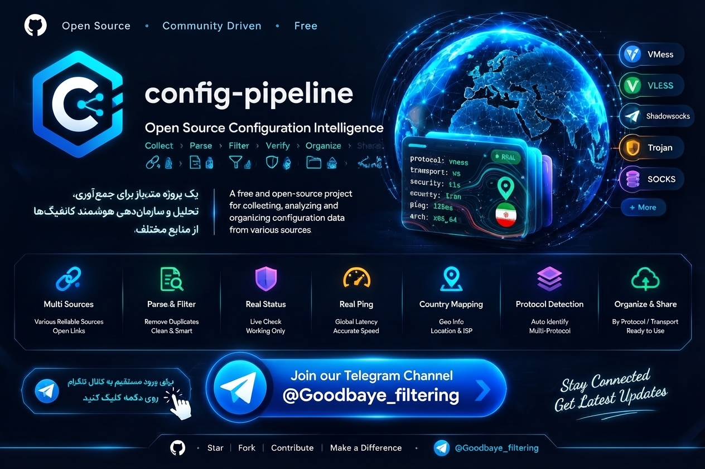

<div align="center">

<!-- بنر اصلی مخزن -->


# ⚡ Config Pipeline (MCI Edition)
### Open-Source Configuration Intelligence & Aggregator

[](https://t.me/Goodbaye_filtering)
[](https://t.me/CONFIG_V2RAY_VIP)
[](LICENSE)
[](https://github.com/alireza786786/config-pipeline/actions)

<p align="center">
  <b>یک خط‌لوله ۵ لایه هوشمند جهت جمع‌آوری، پالایش و بهینه‌سازی کانفیگ‌های همراه اول</b><br>
  <i>A 5-layer intelligent pipeline for collecting, parsing, and optimizing MCI configurations.</i>
</p>

---

### 🌐 انتخاب زبان / Select Language
> برای مشاهده محتوا به زبان دلخواه، روی یکی از بخش‌های زیر کلیک کنید:  
> *Click on the sections below to toggle between Persian and English:*

</div>

<br>

<details open>
<summary><h2>🇮🇷 مشاهده توضیحات به زبان فارسی (کلیک کنید)</h2></summary>

### 📌 درباره پروژه
این پروژه یک سیستم خودکار، پیشرفته و متن‌باز است که به منظور جمع‌آوری، تفکیک جغرافیایی و اعتبارسنجی کانفیگ‌های شبکه‌ای بهینه‌شده برای اپراتور **همراه اول (MCI)** طراحی شده است. خط‌لوله به‌صورت دوره‌ای توسط **GitHub Actions** اجرا شده و پس از بازسازی متادیتا و بررسی پروتکل‌ها، فایل نهایی را مستقیماً به کانال تلگرام ارسال می‌کند.

### 🚀 خط‌لوله هوشمند ۵ لایه
1. **لایه شنود و جمع‌آوری داده (Ingestion):** پایش مداوم آخرین پست‌ها در کانال‌های عمومی تلگرام و منابع معتبر گیت‌هاب بر اساس کلیدواژه‌های اختصاصی همراه اول.
2. **لایه تفکیک و استخراج معنایی (Parsing):** شناسایی و کالبدشکافی پروتکل‌های نوین (VLESS, VMess, Trojan, Reality, gRPC).
3. **لایه شناسایی جغرافیایی و پایش پینگ (GeoIP & Probing):** مکان‌یابی دقیق آی‌پی سرور (پرچم، کشور و شهر) و ثبت تأخیر پینگ.
4. **لایه یکپارچه‌سازی و برندینگ ثابت:** بازنویسی شناسه تمامی سرورها بر اساس الگوی اختصاصی:
   ```text
   👉🆔@Goodbaye_filtering 📡[پرچم] [کشور] ®️[شهر] 🅿️ping:[عدد]ms ⚡[قابلیت]
